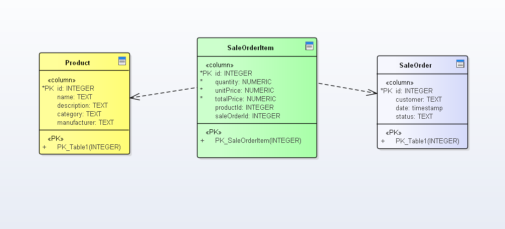

# sale-order-backend

This is the backend side of a technical test in Express for sale order system.

Entities:
Sale Order Item: Represents an individual item within a sales order, with attributes such as Item ID, Quantity, Unit Price, and Total Price.

Product: Represents the product being ordered, with attributes such as Product ID, Name, Description, Category, and Manufacturer. Each Sale Order Item is associated with a specific Product.

Sale Order: Represents the sales order as a whole, with attributes such as Order ID, Customer (the customer placing the order), Date, and Status. A Sale Order can have multiple Sale Order Items.
